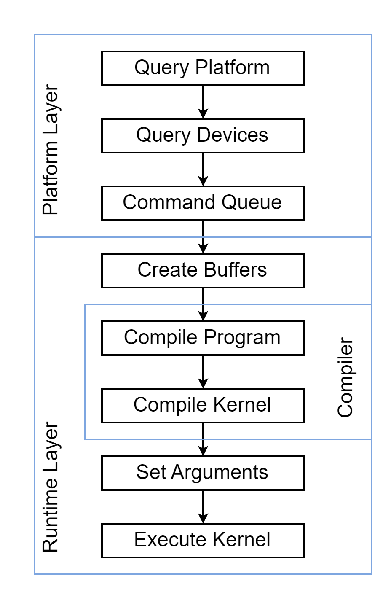

# OpenCL Basics

The OpenCL specification is defined in four parts, called models, that can be summarized as follows:

- **Platform model**: Specifies that there is one processor coordinating execution (the host) and one or more processors capable of executing OpenCL C code (the devices). It defines an abstract hardware model that is used by programmers when writing OpenCL C functions (called kernels) that execute on the devices.
- **Execution model**: Defines how the OpenCL environment is configured on the host and how kernels are executed on the device. This includes setting up an OpenCL context on the host, providing mechanisms for host device interaction, and defining a concurrency model used for kernel execution on devices.
- **Memory model**: Defines the abstract memory hierarchy that kernels use, regardless of the actual underlying memory architecture. The memory model closely resembles current GPU memory hierarchies, although this has not limited adoptability by other accelerators.
- **Programming model**: Defines how the concurrency model is mapped to physical hardware.

Creating and executing a simple OpenCL application takes the steps as shown below.

